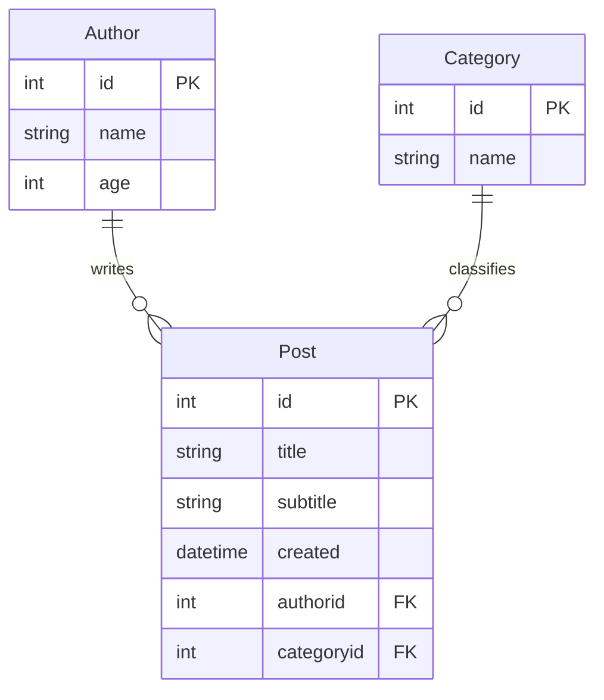

# CRUD API com FastAPI, SQLAlchemy e PostgreSQL

Este projeto implementa uma API RESTful com FastAPI, SQLAlchemy e PostgreSQL, realizando operações de **CRUD** (Create, Read, Update, Delete) para três entidades principais: `Author`, `Category` e `Post`. Os dados são persistidos em um banco PostgreSQL.

---

## Diagrama Entidade-Relacionamento



---

## 🔌 Conexão com Banco de Dados

A API se conecta ao PostgreSQL via SQLAlchemy:

```python
engine = create_engine('postgresql://<USUÁRIO>:<SENHA>@<HOST>:<PORTA>/<NOME_DO_BANCO>')
```

---

## Endpoints

### **Author**

| Método | Rota            | Descrição                   |
| ------ | --------------- | --------------------------- |
| POST   | `/authors`      | Cria um novo autor          |
| PUT    | `/authors`      | Atualiza um autor existente |
| DELETE | `/authors`      | Deleta um autor             |
| GET    | `/authors/all`  | Lista todos os autores      |
| GET    | `/authors/{id}` | Retorna autor + seus posts  |

### **Category**

| Método | Rota                     | Descrição                    |
| ------ | ------------------------ | ---------------------------- |
| POST   | `/categories`            | Cria nova categoria          |
| PUT    | `/categories`            | Atualiza categoria           |
| DELETE | `/categories`            | Deleta categoria             |
| GET    | `/categories`            | Lista todas as categorias    |
| GET    | `/categories/{id}/posts` | Lista posts de uma categoria |

### **Post**

| Método | Rota     | Descrição            |
| ------ | -------- | -------------------- |
| POST   | `/posts` | Cria novo post       |
| PUT    | `/posts` | Atualiza post        |
| DELETE | `/posts` | Deleta post          |
| GET    | `/posts` | Lista todos os posts |

---

## Detalhes de Validação e Erros

- Todos os campos obrigatórios são verificados.
- Retornos de erro padronizados com `JSONResponse`:

  - `400 Bad Request` para dados faltantes;
  - `404 Not Found` para entidades inexistentes;
  - `500 Internal Server Error` para falhas inesperadas.

---

## Como Executar Localmente

```bash
# 1. Instale dependências
pip install fastapi sqlalchemy psycopg2 uvicorn

# 2. Execute o servidor
uvicorn main:app --reload
```

Acesse via navegador:

```
http://127.0.0.1:8000/docs
```
